# Clockless Federated Adaptation

**無全域時鐘下的非同步醫學影像聯邦學習**

Group 4：Asynchronous Distributed ML Adaptation

分散式系統期末 Proposal Deck

---

# 02 01 Motivation｜從醫院合作訓練開始

多家醫院想共同訓練醫學影像模型，但原始資料不能集中。

- 醫院設備、網路、工作負載不同。
- 有些 update 很快，有些 update 很晚。
- 病人族群與影像分布不同。

**問題：不等慢醫院會比較快，但晚到的 update 還可信嗎？**

---

# 03 01 Motivation｜分散式系統核心矛盾

```text
Sync FL: 等所有 client -> 最慢節點決定速度
Async FL: 不等慢 client -> 收到 stale / out-of-order update
```

本專案聚焦：

> throughput vs consistency / convergence correctness

這是 distributed systems 的時間、順序與一致性問題，不只是分類模型問題。

---

# 04 02 Preliminary｜Sync vs Async FL

| Setting | System behavior | Main risk |
|---|---|---|
| Sync FedAvg | round barrier，等待 clients | straggler bottleneck |
| Naive Async | update 到就套用 | stale update instability |
| Buffered Async | 收 B 個 updates 再聚合 | buffer 中仍可能有 conflict |

---

# 05 02 Preliminary｜Logical Staleness

不假設 synchronized physical clock。

```text
server_version = current global model version
client_start_version = version received by the client
staleness = server_version - client_start_version
```

這是 Lamport logical time 在 FL simulator 裡的對應：用 logical version 取代 wall-clock ordering。

---

# 06 03 Problem Formulation｜公平比較

Async 以前表現差，可能只是 update budget 少。

```text
Sync update budget  = rounds × clients
Async update budget = events
Fair comparison     = events = rounds × clients
```

正式矩陣：

```text
9 datasets × 6 methods × 3 seeds = 162 official runs
```

---

# 07 03 Problem Formulation｜評估指標

ML 指標：

```text
best_acc, final_acc, stability_drop = best_acc - final_acc
```

Distributed systems 指標：

```text
p95 staleness, simulated time, effective alpha,
client contribution Gini, time-to-accuracy
```

**accuracy 是結果；staleness / delay / imbalance 解釋原因。**

---

# 08 03 Architecture｜Event-Driven Clockless Simulator

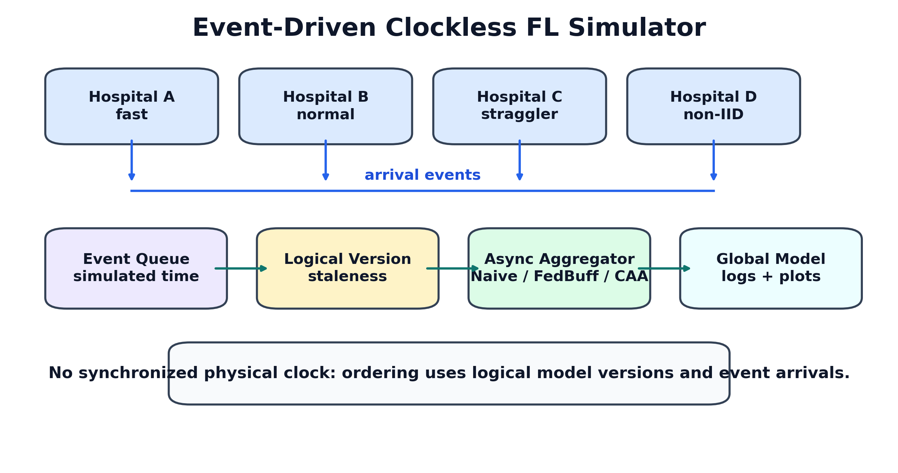

---

# 09 04 Methodology｜Baseline Map

| Method | Role | What it tests |
|---|---|---|
| Sync | upper reference | no async staleness, but barrier |
| Naive Async | stateless async | throughput without correction |
| Staleness | logical-age correction | whether age alone is enough |
| FedBuff | buffered async baseline | whether buffering stabilizes |
| CAA-v1 | agreement-aware | whether direction helps |
| CAA-v2 | final method | direction + trajectory + fairness |

---

# 10 04 Methodology｜CAA-v2 不只是 FedBuff

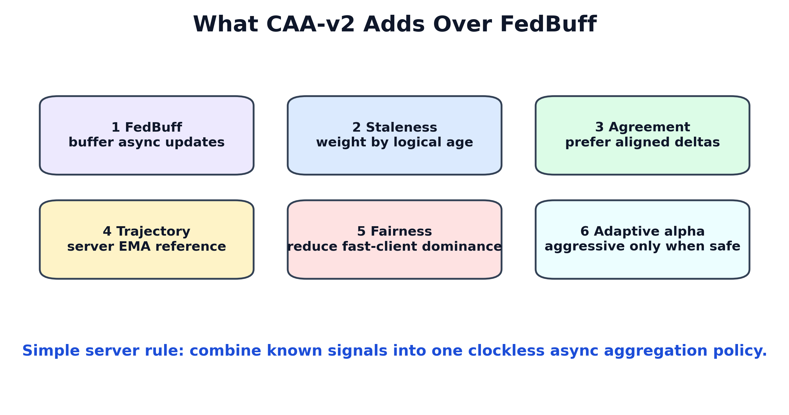

---

# 11 04 Methodology｜CAA-v2 Server Pipeline

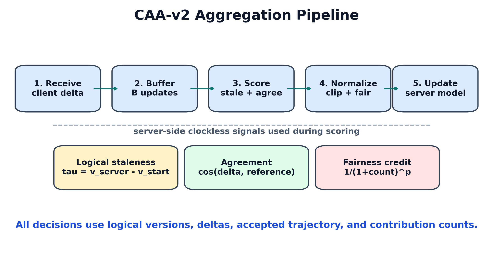

---

# 12 04 Methodology｜Server Decision Flow

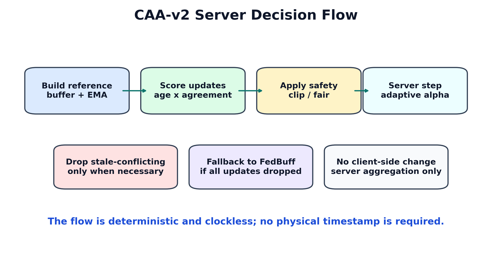

---

# 13 04 Methodology｜核心數學式

每個 client update：

```text
delta_i = client_model_i - model_at_client_start_i
tau_i   = server_version - client_start_version_i
```

CAA-v2 權重：

```text
raw_weight_i = n_i × staleness_decay(tau_i)
             × agreement(delta_i, ref) × fairness_i
```

Server update：

```text
w <- w + alpha_buffer × weighted_average(delta_i)
```

---

# 14 04 Methodology｜Reference Direction

```text
buffer_ref = weighted_average(delta_i, n_i × age_i)
server_ema = EMA(previous accepted server deltas)
ref        = blend(buffer_ref, server_ema)
```

直覺：

- buffer_ref：這批 updates 的群體方向。
- server_ema：近期 global model 真的往哪裡走。
- stale 且反向的 update 不應被盲目放大。

---

# 15 04 Methodology｜Clockless Signals

| Signal | Source | Uses physical clock? |
|---|---|---|
| staleness | server/client logical version | No |
| agreement | delta dot product | No |
| server trajectory | accepted server deltas | No |
| fairness credit | accepted contribution count | No |
| adaptive alpha | mean staleness + agreement | No |

---

# 16 04 Methodology｜Novelty Boundary

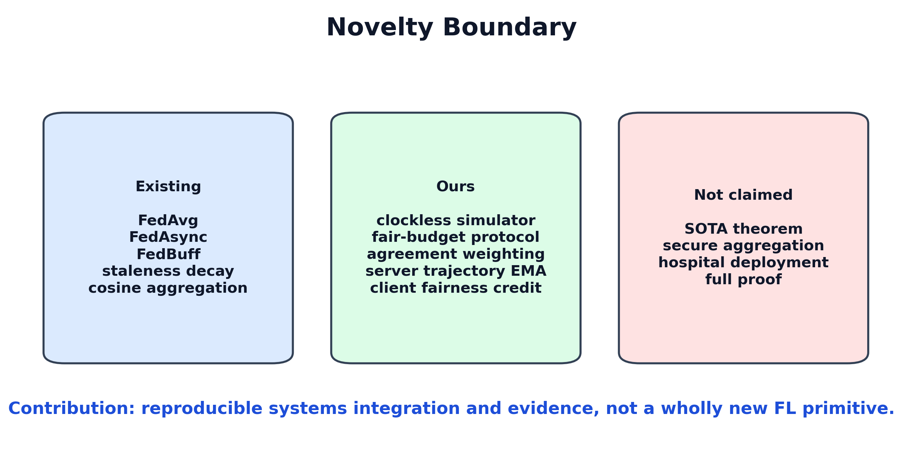

---

# 17 05 Experiment Results｜Fairness Protocol

```text
clients = 10
local_epochs = 1
batch_size = 128
lr = 0.01, cosine scheduler
seeds = 42, 43, 44
async delay = same heterogeneous setting
fair budget = async events = sync rounds × clients
```

正式比較不混用不同 backbone、delay、seed、local epochs 或 update budget。

---

# 18 05 Experiment Results｜Coverage

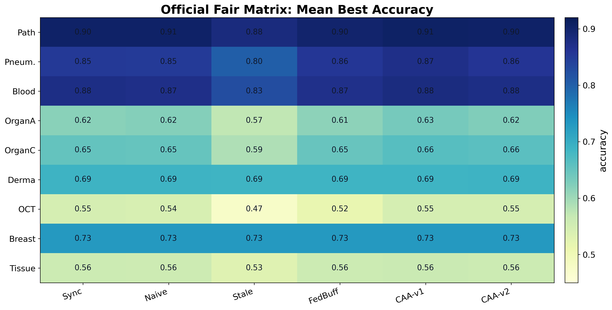

---

# 19 05 Experiment Results｜Overall Dashboard

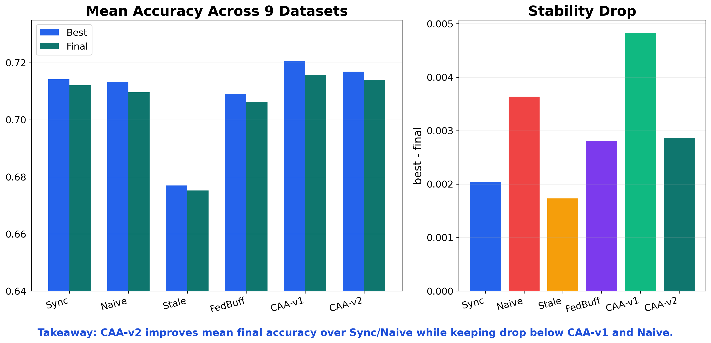

---

# 20 05 Experiment Results｜CAA-v2 vs Sync

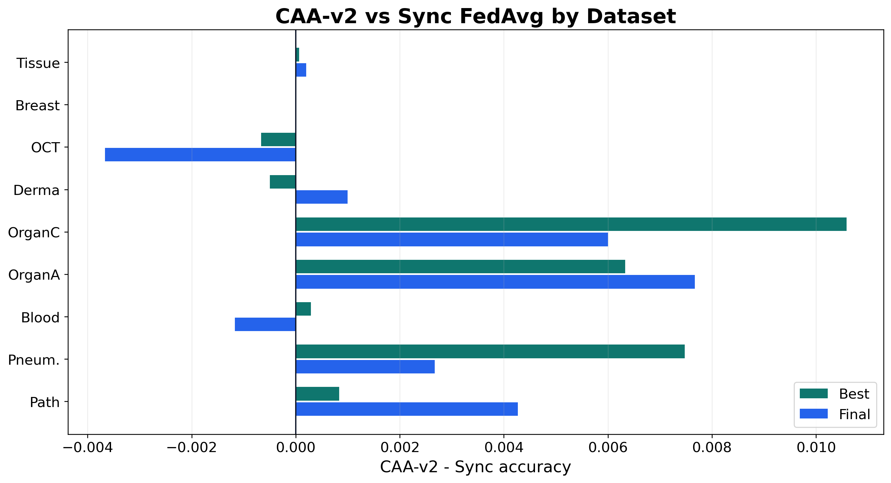

---

# 21 05 Experiment Results｜Async-Sync Gap

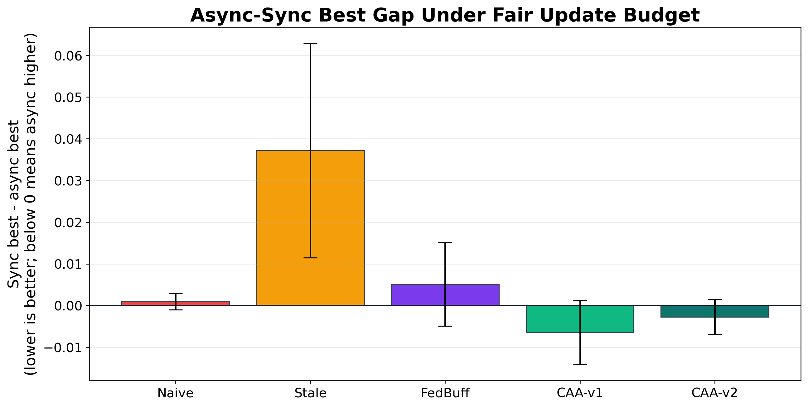

---

# 22 05 Experiment Results｜Stability Drop

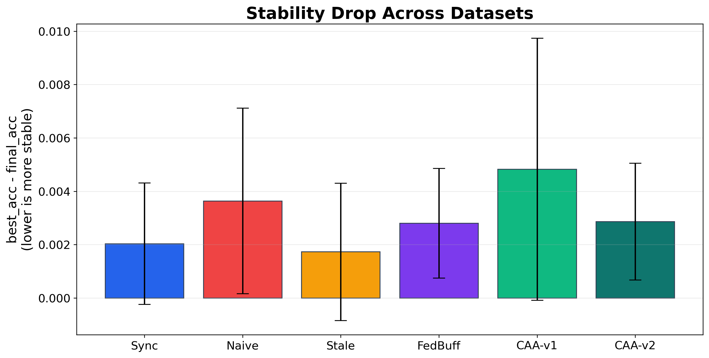

---

# 23 05 Experiment Results｜System Metrics

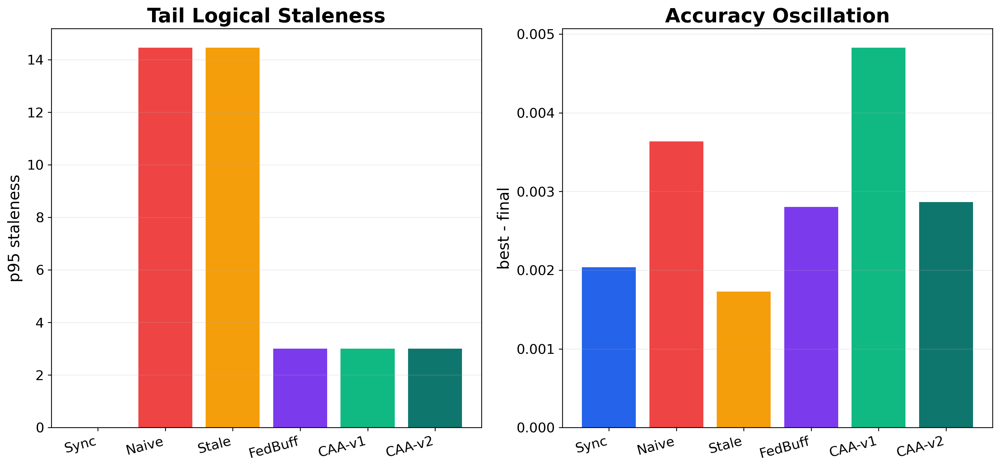

---

# 24 05 Experiment Results｜Non-IID Hospital Scenario

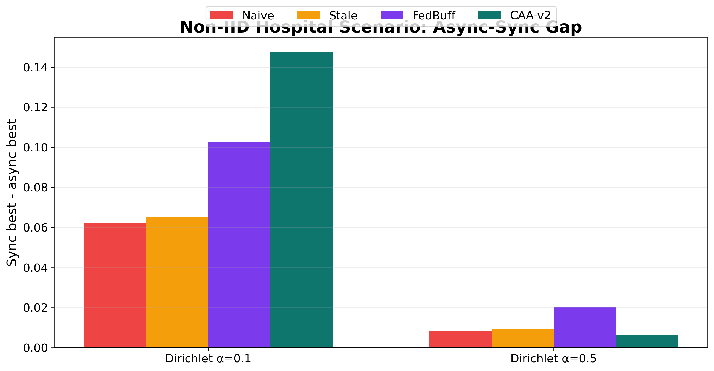

---

# 25 05 Experiment Results｜Straggler Stress

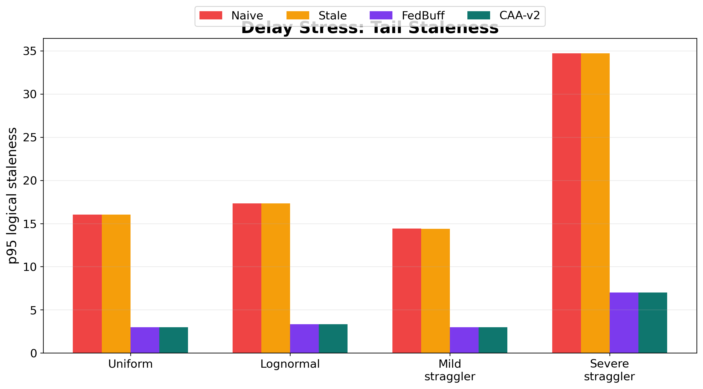

---

# 26 05 Experiment Results｜Simulated Time

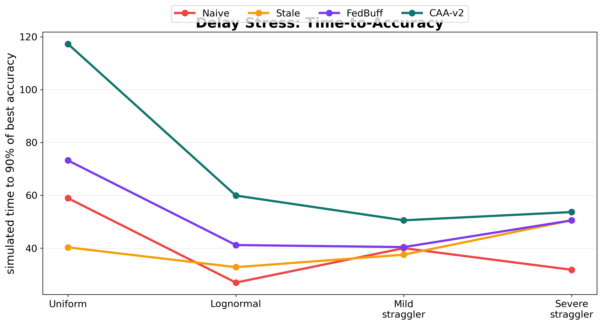

---

# 27 05 Experiment Results｜Ablation

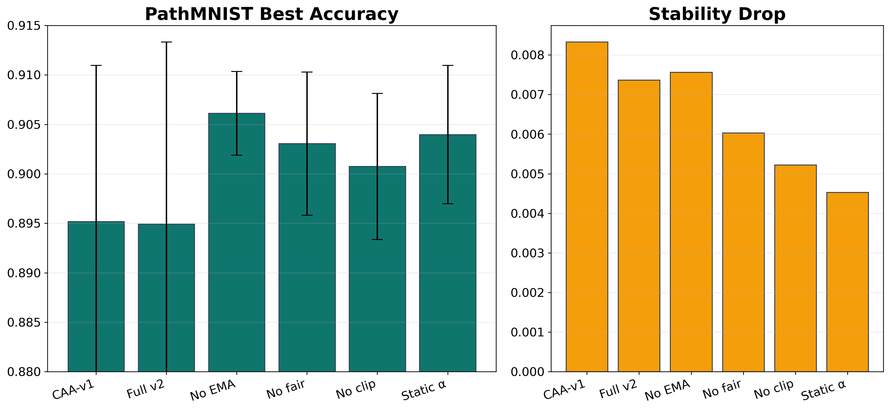

---

# 28 05 Experiment Results｜Final Interpretation

正式 fair matrix：

```text
CAA-v2 best  = 0.7169
CAA-v2 final = 0.7140
Sync final   = 0.7121
Naive final  = 0.7096
```

結論：CAA-v2 不是 universal winner，但它比 Naive 穩、比 staleness-only 不保守，並且在多數資料集接近或超過 Sync。

---

# 29 06 Challenges｜總覽

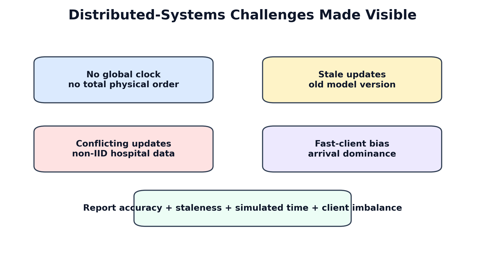

---

# 30 06 Challenges｜No Global Clock, Stale, Conflict

三個問題會同時發生：

```text
No global clock -> cannot totally order distributed events
Stale update    -> trained from old global model
Conflict update -> non-IID direction differs from others
```

CAA-v2 的設計：logical staleness + direction agreement + server trajectory。

---

# 31 06 Challenges｜Fast Clients 與 Privacy Tension

Fast-client domination：

```text
快醫院 arrival rate 高 -> 可能長期主導 global model
```

Privacy tension：

```text
CAA-v2 需要 delta direction / norm
secure aggregation 相容性仍需未來設計
```

所以目前主張是 system simulator / design extension，不宣稱完整 privacy solution。

---

# 32 07 Conclusion｜貢獻總結

1. 用 logical version 建立 no-global-clock async FL simulator。
2. 補上 fair update-budget protocol。
3. 提出 CAA-v2：agreement + server trajectory + fairness credit。
4. 用 9 datasets × 6 methods × 3 seeds 驗證。
5. 用 staleness、simulated time、client Gini 補足 distributed systems 分析。

---

# 33 07 Conclusion｜Final Claim

> Under a fair update budget, CAA-v2 makes clockless asynchronous FL approach Sync FedAvg across diverse MedMNIST datasets, while reducing the instability of Naive Async and avoiding the over-conservatism of staleness-only aggregation.

中文：

> CAA-v2 讓無全域時鐘的非同步 FL 接近 Sync FedAvg，同時比 Naive Async 穩、比 staleness-only 不保守。

---

# 34 07 Future Work

- 對比 FedStaleWeight、SEAFL、FedPSA、FedCompass。
- non-IID / straggler stress 增加 multi-seed。
- 加入 real network / hospital-like traces。
- 補 balanced accuracy、macro-F1、minority recall、AUROC。
- 設計 secure-aggregation-compatible agreement statistics。
- 加入簡化 convergence / stability analysis。

---

# 35 References

- Lamport, *Time, Clocks, and the Ordering of Events in a Distributed System*, CACM 1978.
- McMahan et al., *Communication-Efficient Learning of Deep Networks from Decentralized Data*, AISTATS 2017.
- Xie et al., *Asynchronous Federated Optimization*, 2019.
- Nguyen et al., *Federated Learning with Buffered Asynchronous Aggregation*, 2021.
- Ma et al., *FedStaleWeight*, 2024.
- Yang et al., *MedMNIST v2*, Scientific Data 2023.
